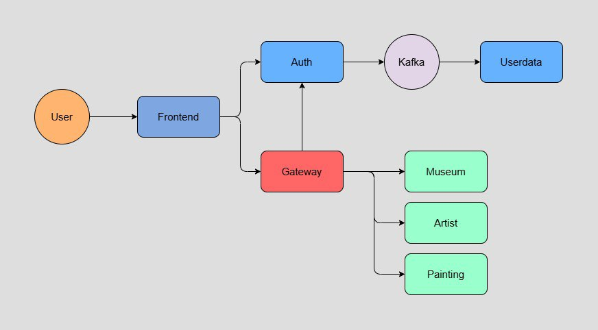
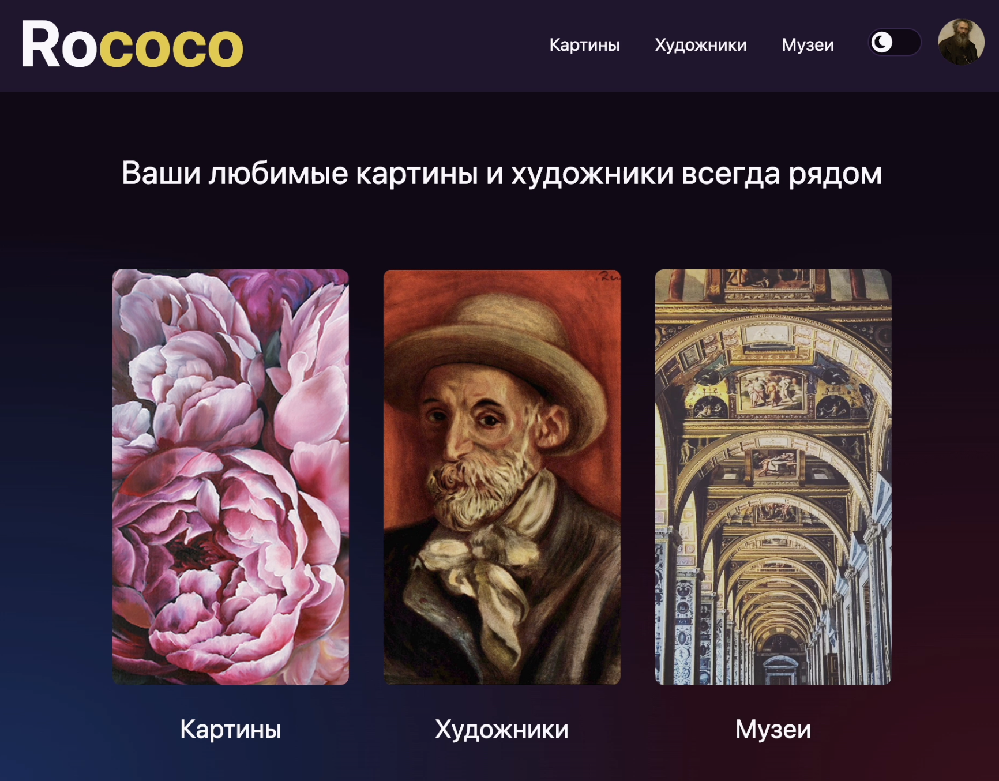

# ROCOCO
Rococo – Your Personal Guide to the World of Painting!

Step into the fascinating world of art with Rococo! Explore masterpieces by legendary artists, uncover the secrets behind their creation, 
and delve into the lives of the great painters who shaped history. Discover the rich collections of renowned museums from around the globe, find hidden gems, and deepen your understanding of painting, culture, and history.

With Rococo, every artwork tells a story, and every museum opens the door to a world of inspiration.
Let your journey into the beauty of art begin!

# Setup Guide

# Local
To run service on your local machine, run the scripts in order:

```bash
# Start docker containers for Postgres, Kafka, and Zookeeper
# Builds, runs tests, and packages JAR files
bash ./local-setup.sh

# Starts all backend services
bash ./local-all.sh

# Starts front-end app
bash ./local-client.sh
```

Service URLS
```text
Frontend    http://localhost:3000/
Auth        http://localhost:9000/
Gateway     http://localhost:8080/
User Data   http://localhost:8089/
Artist      http://localhost:8282/
Museum      http://localhost:8383/
Painting    http://localhost:8484/
```

# Default username and password
E2E tests either use a given username/password or register a new user.

`@ApiLogin`: Accepts username and password. If none is given the default username and password will be used.
```text
Default username: admin
Default password: admin
```

`@User`: Registers a new user with given username or if skipped a random username will be created.

# Local Tests
After all the services and the frontend is up and running, run the following commands to run E2E test locally:

```bash
# Set the test profile to local
export PROFILE=local

# Runs e2e test suit
./gradlew :rococo-e2e-tests:test
```

# Docker
To run services in dockerized mode, follow the steps:
Set the system-wide environment variables, in `.zshrc` (or equivalent):

```bash
# Credentials to pull and push Docker Hub
export DOCKER_USERNAME="<username>"
export DOCKER_PASSWORD="<token from docker hub>"
```

## Clean start
To run all the services and its dependencies in dockerized mode, run the following command:

```bash
# Clear existing containers and start over
bash docker-compose-dev.sh
```

Check the status of the services until they become healthy:
```bash
docker ps
```

Service URLS
```text
Frontend    http://frontend.rococo.dc/
Auth        http://auth.rococo.dc:9000/
Gateway     http://gateway.rococo.dc:8080/
User Data   http://userdata.rococo.dc:8089/
Artist      http://artist.rococo.dc:8282/
Museum      http://museum.rococo.dc:8383/
Painting    http://painting.rococo.dc:8484/
```

Edit the `/etc/hosts` file with edit permissions and add the required entries:

```text
## Rococo services
127.0.0.1       auth.rococo.dc
127.0.0.1       gateway.rococo.dc
127.0.0.1       frontend.rococo.dc
```

## Re-run
In order to stop the services (and keep the data) and start again, run the commands:

```bash
docker compose down
docker compose up
```

# Dockerized Tests
## Clean start
To run the E2E tests in dockerized mode run the script:

```bash
bash docker-compose-e2e.sh
```

The reports are sent to Allure service, and also available on local directory `{projectRoor}/allure-results`.

## Re-run
In order to stop the services and run in testing mode again, run the commands:

```bash
docker compose --profile test down
docker compose --profile test up
```

# Report
After running the dockerized E2E tests, the report is available at:
  - Allure UI http://localhost:5252/allure-docker-service-ui/projects/default
  - Allure Service http://localhost:5050/allure-docker-service/projects/default/reports/latest/index.html
  - Local directory `{projectRoor}/allure-results`

### Services



  
### Rococo Front

